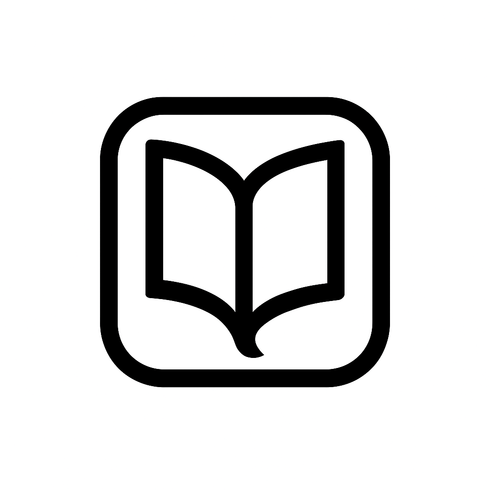

# شیرازه


یک ویکی ساز ساده، سریع و سمت کاربر با پشتیبانی کامل از زبان فارسی.

<center></center>

**شیرازه (Shirazeh)** یک راهکار مدرن برای ساخت ویکی، مستندات و وب‌سایت‌های محتوا-محور است که **بدون نیاز به سرور** و هیچ‌گونه فرآیند ساخت (build) کار می‌کند. تمام پردازش‌ها در مرورگر کاربر انجام می‌شود و محتوای شما به صورت فایل‌های مارک‌داون ساده مدیریت می‌شود.

## ساخته شده با هوش
این پروژه با همفکری و استفاده از ابزارهای هوش مصنوعی پیشرفته مانند Gemini، Claude و ChatGPT و با هدایت و ویرایش نهایی یک توسعه‌دهنده انسانی ساخته شده است. این رویکرد ترکیبی به ما اجازه داد تا با سرعت و دقت بیشتری، یک محصول باکیفیت و مدرن خلق کنیم.

## ویژگی‌های کلیدی

- **بدون نیاز به سرور:** پروژه را در هر هاست استاتیکی آپلود کنید و تمام!
- **مبتنی بر مارک‌داون:** محتوای خود را با سینتکس ساده و محبوب مارک‌داون بنویسید.
- **کاملاً شخصی‌سازی‌پذیر:** رنگ‌ها، چیدمان و رفتار ویکی را به سادگی از طریق یک فایل `config.js` تغییر دهید.
- **پشتیبانی از محتوای خارجی:** فایل‌های مارک‌داون را مستقیماً از URLهای خارجی (مانند یک مخزن گیت‌هاب) بارگذاری و نمایش دهید.
- **طراحی راست‌چین:** تجربه‌ی خواندن بهینه برای محتوای فارسی.
- **ساختار منعطف:** فایل‌ها و پوشه‌های خود را به هر شکلی که دوست دارید سازماندهی کنید.
- **واکنش‌گرا:** طراحی زیبا و کاربردی در تمام دستگاه‌ها، از موبایل تا دسکتاپ.

## نصب سریع

1.  **دانلود:** آخرین نسخه پروژه را دانلود کرده و از حالت فشرده خارج کنید.
2.  **اجرا:** برای مشاهده پروژه به صورت محلی، یک سرور ساده اجرا کنید.
    ```bash
    npx serve .
    ```
3.  **شخصی‌سازی:** فایل `config/config.js` و فایل‌های مارک‌داون (`.md`) را ویرایش کنید تا ویکی خود را بسازید.

## سندها

برای اطلاعات کامل‌تر، به لینک‌های زیر مراجعه کنید:

-   **[راهنمای شروع سریع](./docs/gettingStarted.md)**: آموزش گام به گام نصب و راه‌اندازی.
-   **[پیکربندی](./docs/configuration.md)**: راهنمای کامل شخصی‌سازی ویکی.
-   **[نوشتن محتوا](./docs/writingContent.md)**: بهترین روش‌ها برای مدیریت محتوا و منوها.
-   **[معماری پروژه](./docs/architecture.md)**: آشنایی با ساختار فنی شیرازه.

## مجوز

این پروژه تحت مجوز MIT منتشر شده است. برای اطلاعات بیشتر فایل [LICENSE](./LICENSE) را مطالعه کنید.