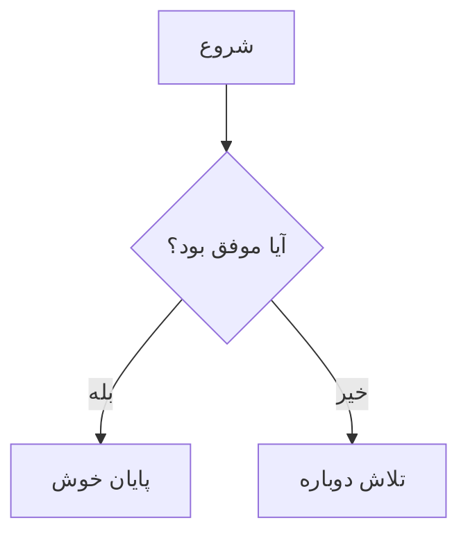
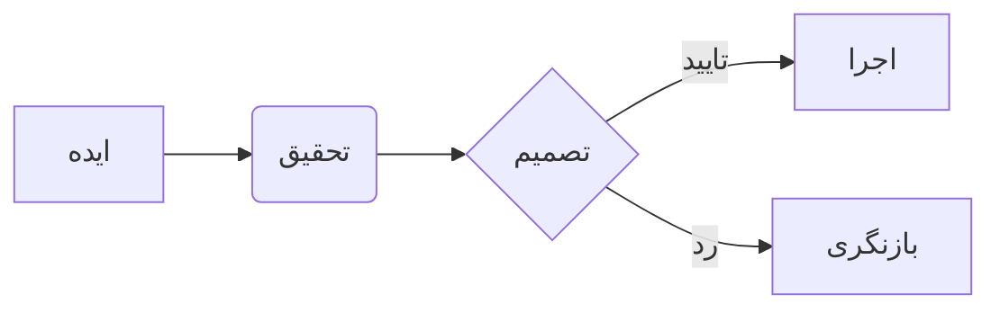
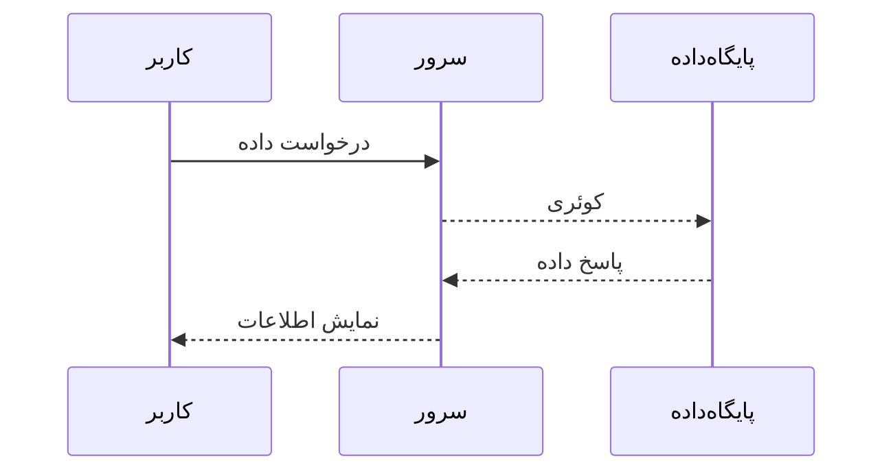
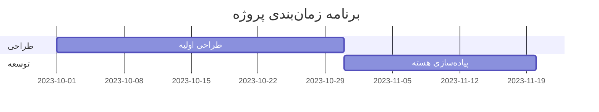

# افزونه نمودار Mermaid (Mermaid Diagrams)

این افزونه قدرت کتابخانه محبوب **Mermaid.js** را به شیرازه می‌آورد. با استفاده از این افزونه، می‌توانید نمودارهای پیچیده، فلوچارت‌ها، نمودارهای توالی (Sequence Diagrams) و موارد دیگر را با استفاده از سینتکس متنی ساده، مستقیماً داخل فایل‌های مارک‌داون خود ترسیم کنید.

## ویژگی‌های اصلی

-   **ترسیم با متن:** بدون نیاز به ابزارهای طراحی، نمودار خود را با کدهای خوانا بنویسید.
-   **هماهنگی با تم:** تم نمودارها به صورت خودکار با تغییر تم شیرازه (روشن/تاریک) به‌روزرسانی می‌شود.
-   **بارگذاری هوشمند (Lazy Loading):** کتابخانه Mermaid.js تنها در صفحاتی که واقعاً شامل نمودار هستند بارگذاری می‌شود تا سرعت برنامه حفظ شود.
-   **واکنش‌گرا:** نمودارهای عریض به صورت خودکار قابلیت اسکرول افقی پیدا می‌کنند تا در دستگاه‌های موبایل چیدمان صفحه را به‌هم نریزند.
-   **سازگار با راست‌چین:** بهینه‌سازی شده برای نمایش صحیح در محیط‌های RTL.

## فعال‌سازی افزونه

برای فعال کردن این افزونه، مسیر آن را به لیست `plugins` در فایل `config.js` اضافه کنید:

```javascript
// in config/config.js
window.shirazeh = {
  // ...
  plugins: [
    'src/plugins/mermaid/mermaid.js', // فعال‌سازی افزونه Mermaid
    // ... سایر افزونه‌ها
  ],
  // ...
};
```

## نحوه استفاده

برای ترسیم نمودار، از بلوک‌های کد با زبان `mermaid` استفاده کنید:

````markdown

````

## مثال‌های کاربردی

### ۱. فلوچارت ساده (Flowchart)
````markdown

````

### ۲. نمودار توالی (Sequence Diagram)
````markdown

````

### ۳. نمودار گانت (Gantt Chart)
````markdown

````

> **نکته:** برای مشاهده تمام قابلیت‌ها و سینتکس‌های موجود، می‌توانید به [مستندات رسمی Mermaid](https://mermaid.js.org/intro/) مراجعه کنید.
